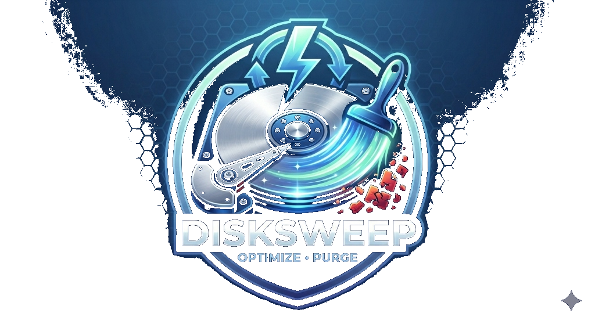

<div align="center">
  
  <h1>DiskSweep</h1>
  <p><strong>A Premium Windows System Optimizer & Storage Cleaner</strong></p>
  
  <p>
    
    
    
    
  </p>
</div>

<hr/>

## 🚀 Overview

DiskSweep is an ultra-modern, lightning-fast system optimization utility built for modern Windows environments. Designed with a stunning UI inspired by Windows 11 aesthetics, DiskSweep offers powerful tools to reclaim disk space, optimize RAM, manage background processes, and analyze storage usage without compromising system stability.

## ✨ Features

- **🛡️ Ultra-Powerful Cleaner**: Safely identifies and clears temporary files, Windows Update caches, browser leftovers (Chrome, Edge, Brave), game client caches (Steam, Epic, Discord), and GPU caches (NVIDIA, AMD).
- **📊 Storage Analyzer**: A blazing-fast, multithreaded directory scanner to visualize exactly what is consuming your storage.
- **⚡ Performance Tuner**: 
  - **RAM Optimizer**: Natively interacts with Windows APIs to flush standby lists and working sets, freeing up gigabytes of unused memory instantly.
  - **Network Booster**: Optimizes TCP parameters and resets Winsock/DNS to lower latency for Gaming or Streaming modes.
- **🎯 Duplicate Finder**: Uses true SHA-256 cryptographic hashing to identify exact duplicates of files regardless of filename.
- **🛑 Background Manager**: Scans for heavy non-system processes and allows force-termination with one click to recover resources.
- **🎨 Premium UI**: A highly polished, hardware-accelerated interface built with React, Tailwind CSS, and Framer Motion.

## 📥 Installation

1. Go to the [Releases](https://github.com/Baxitts-wq/Diskcleaner/releases) page.
2. Download the latest `DiskSweep-Setup-x64.exe` or the standalone `.zip`.
3. Run the application. **(Note: Run as Administrator for deep cleaning and RAM optimization features to work properly).**

## 💻 Development

### Prerequisites
- Node.js (v18 or higher)
- Windows 10/11 (Required for native PowerShell and CIM queries)

### Setup

```bash
# Clone the repository
git clone https://github.com/Baxitts-wq/Diskcleaner.git

# Navigate to the directory
cd Diskcleaner

# Install dependencies
npm install

# Start the application in development mode
npm run dev
```

### Packaging & Build

To package DiskSweep into a distributable executable:

```bash
# Generate the optimized production build and package it
npm run package
```
This will create a `release/DiskSweep-win32-x64` folder containing the compiled standalone application.

## 🏗️ Architecture

DiskSweep heavily relies on safe, native Windows APIs rather than third-party wrappers:
- **System Metrics**: Utilizes Node.js native `os` module for ultra-fast, crash-free resource polling.
- **Disk Information**: Leverages `Get-CimInstance Win32_LogicalDisk` via PowerShell, completely bypassing the deprecated `WMIC`.
- **Memory Management**: Inlines C# execution using `psapi.dll` to perform safe `EmptyWorkingSet` sweeps.
- **File Hashing**: Uses Node's native `crypto` module with fast file streaming for SHA-256 analysis.

## 🔒 Safety First

DiskSweep operates on a strict **"Safe to Delete"** philosophy. It will never target critical Windows directories, Boot partitions, or essential drivers. All cleaning operations wrap file deletions in `try/catch` blocks to gracefully skip locked files.

## 📄 License

This project is licensed under the MIT License - see the [LICENSE](LICENSE) file for details.
